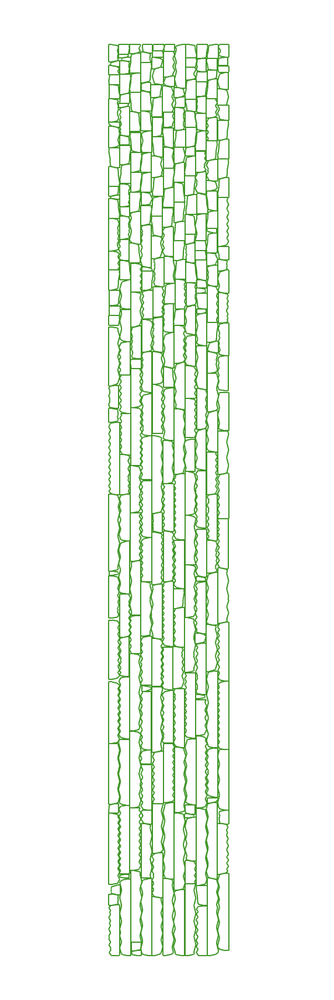
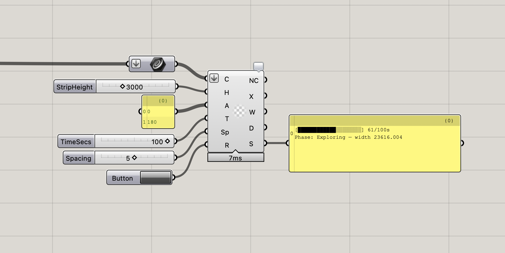

# SparrowGH

A Grasshopper plugin for 2D irregular nesting, built on top of [Sparrow](https://github.com/JeroenGar/sparrow) - a Rust-based solver for 2D irregular strip packing problems.

The plugin runs the Sparrow engine as a subprocess and bridges its JSON I/O into Grasshopper geometry.

---

## Installation

Download the folder matching your platform from [`dist/`](dist/) and copy all three files into your Grasshopper Libraries folder:

| Platform | Libraries folder |
|---|---|
| Mac (Apple Silicon) | `~/Library/Application Support/McNeel/Rhinoceros/8.0/Plug-ins/Grasshopper (b45a29b1-4343-4035-989e-044e8580d9cf)/Libraries/` |
| Mac (Intel) | same path |
| Windows | `%APPDATA%\Grasshopper\Libraries\` |

Restart Rhino. A **Sparrow** tab will appear in Grasshopper.

No Rust or .NET SDK required — the compiled engine binary is included in each platform folder.

---

## Component

**Sparrow Nest** — found under the Sparrow tab, Nesting panel.

### Inputs

| | Nick | Description |
|---|---|---|
| Curves | C | Closed planar curves to nest. Projected to XY plane automatically. |
| StripHeight | H | Fixed height of the material strip. |
| Angles | A | Allowed rotation angles in degrees e.g. `{0, 90, 180, 270}`. Leave empty for continuous rotation. |
| TimeSecs | T | Optimisation time in seconds. Default 30. |
| Spacing | Sp | Minimum gap between pieces in model units. Default 0. |
| Run | R | Button or Toggle. Nesting fires on the rising edge (false → true). |

### Outputs

| | Nick | Description |
|---|---|---|
| NestedCurves | NC | Nested curves. |
| Transforms | X | One Transform per curve. |
| StripWidth | W | Optimised strip length. |
| Density | D | Packing density [0–1]. |
| Status | S | Progress text — connect a Panel to watch the run. |


<table><tr>
<td></td>
<td></td>
</tr></table>

---

## Building from source

### Requirements

- [Rust](https://rustup.rs/) stable toolchain
- [.NET SDK 8+](https://dot.net)
- Rhino 7 or 8 (for the Grasshopper SDK references)

### Engine

```bash
cd sparrow
cargo build --release
```

Cross-platform:

```bash
rustup target add x86_64-apple-darwin
rustup target add x86_64-pc-windows-gnu
brew install mingw-w64  # for Windows cross-compile from macOS

cargo build --release --target x86_64-apple-darwin
cargo build --release --target x86_64-pc-windows-gnu
```

### Plugin

```bash
cd SparrowGH
./build.sh
```

Compiles `SparrowGH.gha` and installs it alongside the engine binary into your Grasshopper Libraries folder.

---

## Notes

- The `sparrow/` folder is a fork of [JeroenGar/sparrow](https://github.com/JeroenGar/sparrow) with one addition: a `--spacing` / `-p` CLI flag that maps to `min_item_separation` in the engine config.
- The plugin communicates with the engine via JSON files in the system temp directory. No FFI.
- Results are cached per run — pressing Run again starts a new optimisation from scratch.

---

## License

Plugin code: MIT. 

Engine: see [`sparrow/LICENSE`](sparrow/LICENSE).
