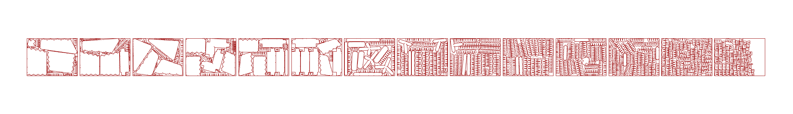
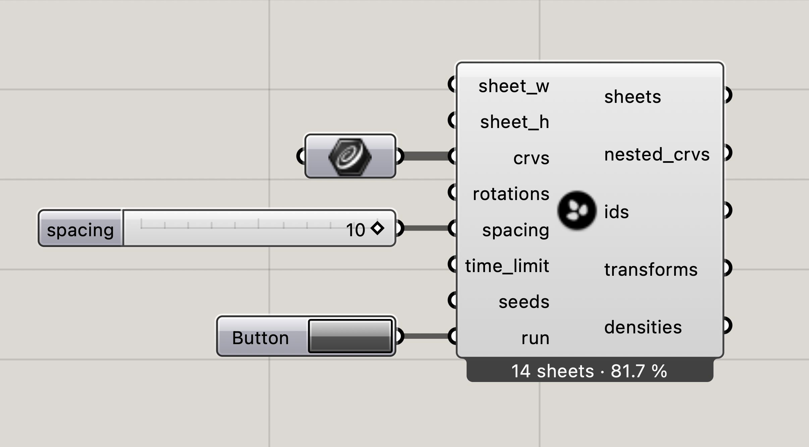
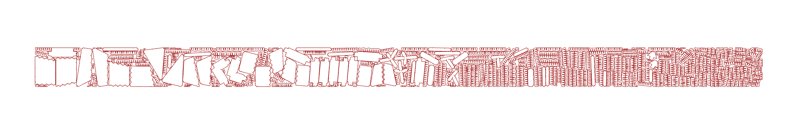
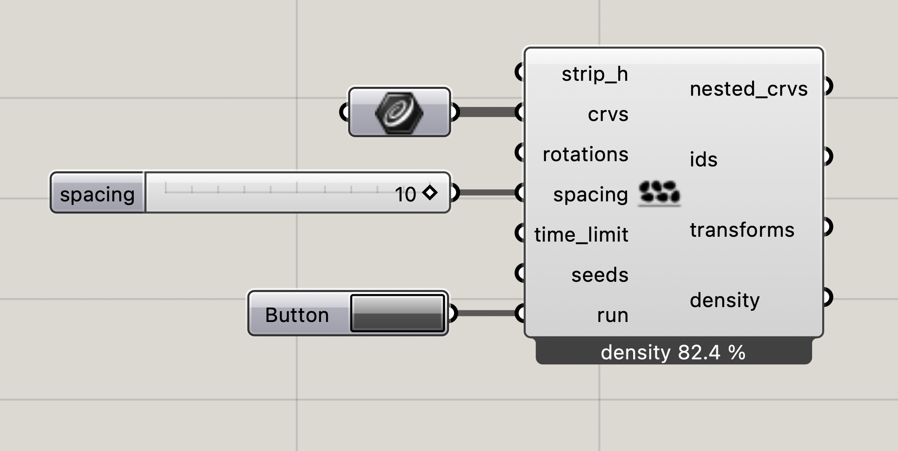

# SparrowGH

A Grasshopper plugin for 2D irregular nesting, built on top of [Sparrow](https://github.com/JeroenGar/sparrow) — a state-of-the-art Rust-based solver for 2D irregular packing problems.

This fork extends the original Sparrow engine with **bin packing** (nesting onto multiple fixed-size sheets) alongside the original **strip packing** mode. Both are exposed as Grasshopper components.

The grasshopper components run on a background thread and are non-blocking.

## Installation

1. Go to the [Releases](../../releases) page and download the zip for your platform (`mac-arm64`, `mac-x64`, or `windows-x64`).
2. Extract and copy the three files into your Grasshopper Libraries folder
3. Restart Rhino. A **Sparrow** tab will appear in Grasshopper with two components.

## Components

### Sparrow Nest  `SpNest`

Nests closed planar curves onto one or more fixed-size *rectangular sheets*. Outputs a DataTree of nested curves, indices and transforms per sheet.

### Sparrow Strip Nest  `SpStrip`

Nests closed planar curves into *a strip* of fixed height and *variable width*. Returns a flat list of nested curves.

## Notes
- Input multiple `seeds` (for example: [1, 2, 3]); the solver will return the best result - processes will run in parallel with the same time limit.
- Disable a running component to kill the engine process immediately.
- Results are cached — the last successful run is shown until you press Run again.
- The engine communicates via JSON in the system temp directory. no FFI, no network.
- For build instructions and input format details see [`README_dev.md`](README_dev.md).

## License

Plugin code: MIT.  
Engine: see [`sparrow/LICENSE`](sparrow/LICENSE).
